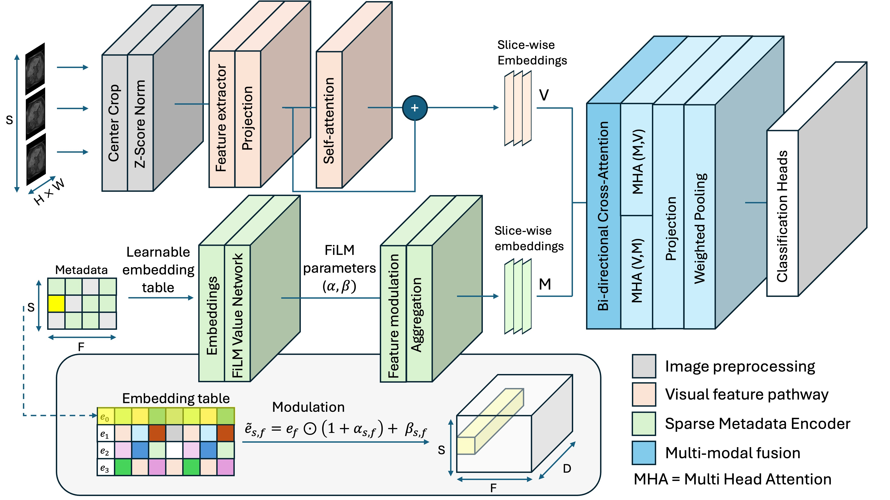

# Revisiting Integration of Image and Metadata for DICOM Series Classification: Cross-Attention and Dictionary Learning

[](https://github.com/MatthiasLen/img-meta-cls/actions/workflows/ci.yml)
[](https://arxiv.org/abs/2602.23833)
[](https://www.python.org/downloads/)
[](LICENSE)

Code accompanying the preprint "Revisiting Integration of Image and Metadata for DICOM Series Classification: Cross-Attention and Dictionary Learning" [arXiv:2602.23833](https://arxiv.org/abs/2602.23833).



The repository implements multimodal DICOM series classification models that combine image content and acquisition metadata, together with image-only and metadata-only baselines. The main experiment surface is the Duke Liver MRI benchmark used in the paper.

## Paper Summary

The paper studies DICOM series classification under three practical failure modes: heterogeneous slice content, variable series length, and missing or inconsistent metadata. The proposed approach addresses these issues with:

- a 2.5D image encoder operating on equidistantly sampled slices,
- a sparse, missingness-aware metadata encoder that avoids explicit imputation,
- cross-modal fusion through bi-directional attention between image and metadata representations.

The codebase also includes Duke baselines used for comparison in the paper:

- [`net4_duke`](IMC/net4_duke/README.md): Duke training, inference, and CV workflow for the multimodal cross-attention model and image-only ablation,
- [`net6`](IMC/net6/README.md): two-stage CNN+RF baseline,
- [`net7`](IMC/net7/README.md): 3D volumetric image-only baseline,
- [`xgboost`](IMC/xgboost/README.md): metadata-only baseline.

## In-Domain Results (Duke Liver MRI, 5-fold CV)

Weighted F1 scores from Table 2 of the paper:

| Exp. | Module | Modality | Method | Weighted F1 (%) |
|---|---|---|---|---|
| (1) | `net4_duke` | Image | 2D CNN (DenseNet-121, single slice, `--modality image`) | 85.09 ± 1.31 |
| (2) | `net7` | Image | 3D CNN + Pyramid Pooling (ResNet-3D) | 88.33 ± 1.92 |
| (3) | `xgboost` | Metadata | XGBoost on tabular DICOM features | 74.71 ± 2.34 |
| (4) | `net4_duke` | Joint | 2.5D CNN + dense MLP encoder, zero imputation, concat fusion | 93.51 ± 1.89 |
| (5) | `net4_duke` | Joint | 2.5D CNN + dense MLP encoder, learned imputation, concat fusion | 93.21 ± 3.48 |
| (6) | `net6` | Joint | Two-stage: RF gates CNN predictions (Miller et al.) | 87.01 ± 0.97 |
| **Ours** | `net4_duke` | Joint | 2.5D CNN + Sparse Metadata Encoder (SME) + BCA fusion | **96.66 ± 1.03** |

## Repository Scope

This repository is focused on code needed to understand and reproduce the Duke experiments and the model components described in the paper.

- Duke dataset files are not included.
- The large in-house multi-institutional cohort from the paper is not part of this repository.
- You must provide dataset and metadata locations through environment variables or CLI flags.

## Setup

This repository uses `uv` and targets Python 3.11+.

```bash
uv sync
```

Activate the environment if you want an interactive shell:

```powershell
.\.venv\Scripts\Activate.ps1
```

```bash
source .venv/bin/activate
```

Install the local Git hooks if you want the same checks to run before each commit:

```bash
uv run pre-commit install
```

## Dataset Preparation

All Duke experiments require three inputs:

| Input | Description | Environment variable |
|---|---|---|
| Duke MRI images | Root directory containing one sub-folder per series | `LOCAL_DATASET_PATH` |
| Label CSV | Per-series labels and 5-fold split | `LABEL_CSV_PATH` |
| Metadata parquet | Encoded DICOM metadata (one row per slice or per series) | `METADATA_PATH` |

Set these before running any training or inference script:

```bash
export LOCAL_DATASET_PATH=/path/to/duke_images
export METADATA_PATH=/path/to/encoded_metadata.parquet
export LABEL_CSV_PATH=/path/to/labels.csv
```

CLI overrides (`--dataset_path`, `--metadata_path`, `--label_csv_path`) take precedence over environment variables.

### Step 1 – Obtain the Duke Liver MRI Dataset

The Duke Liver MRI dataset is publicly available, see this [paper](https://pmc.ncbi.nlm.nih.gov/articles/PMC10546360/).  Download and unpack the DICOM files so that each MRI series
resides in its own sub-directory under `LOCAL_DATASET_PATH`.

### Step 2 – Create the label CSV

The label CSV must contain one row per series with at minimum:

- A column that can be used to match series to their DICOM files,
- a `SequenceType_Code_norm` column with one of the 13 class labels,
- fold assignment columns `fold_0` … `fold_4` with values `train`, `val`, or `test`.

See [`IMC/data/README.md`](IMC/data/README.md) for the full format specification,
the class mapping table, and a sample CSV.

### Step 3 – Encode DICOM metadata

Use the included encoding script to generate the metadata parquet from the raw
DICOM files:

```bash
# Slicewise parquet (one row per DICOM file) – used by net4, net6
uv run python -m IMC.data.encode_metadata \
    --dicom_root "$LOCAL_DATASET_PATH" \
    --output encoded_metadata.parquet \
    --mode slicewise
```

For the XGBoost baseline, a series-level parquet is required instead:

```bash
# Series-level parquet (one row per series folder) – used by xgboost
uv run python -m IMC.data.encode_metadata \
    --dicom_root "$LOCAL_DATASET_PATH" \
    --output encoded_metadata_series.parquet \
    --mode series

export XGBOOST_METADATA_PATH=/path/to/encoded_metadata_series.parquet
```

See [`IMC/data/README.md`](IMC/data/README.md) for full encoding documentation.

## Quick Validation

Run the pre-commit checks used by CI:

```bash
uv run pre-commit run --all-files
```

Run the test suite:

```bash
uv run pytest -q
```

## Main Experiment Entry Points

### Network 4: multimodal image + metadata fusion on Duke

**Paper experiments: (4), (5), and the proposed method.** See the
[Network v04 README](IMC/net4_duke/README.md) for the full architecture,
per-experiment commands, and the Duke training / inference / CV workflow.

Train 5-fold CV with the proposed method (Sparse Metadata Encoder + BCA fusion):

```bash
uv run python -m IMC.net4_duke.train \
  --modality combined \
  --metadata_enc_type sparse \
  --sparse_enc_version v1 \
  --fusion_module_version v1 \
  --n_slices 10 \
  --gpu 0
```

Run inference for a trained fold:

```bash
uv run python -m IMC.net4_duke.infer \
  --ckpt ./logs/<run>/fold_0/best_model.pth \
  --output_dir ./infer_out/net4/fold_0 \
  --modality combined \
  --folds 0 \
  --run_eval
```

Aggregate fold-level evaluation results:

```bash
uv run python -m IMC.net4_duke.summarize_cv ./logs/<run>
```

### Network 6: two-stage CNN+RF baseline

**Paper experiment (6): two-stage CNN+RF (Miller et al.).**
See the [Network 6 README](IMC/net6/README.md) for architecture details and
per-experiment commands.

Train the CNN:

```bash
uv run python -m IMC.net6.train_duke --gpu 0
```

Train the RF (required for experiment 6):

```bash
uv run python -m IMC.net6.train_rf_duke --out_dir ./rf_checkpoints/duke_net6
```

Inference — CNN only or with RF gate (exp 6):

```bash
# CNN only (no RF gate)
uv run python -m IMC.net6.infer_duke \
  --ckpt ./logs/<run>/fold_0/best_model.pth \
  --output_dir ./infer_out/net6/fold_0

# CNN + RF gate
uv run python -m IMC.net6.infer_duke \
  --ckpt ./logs/<run>/fold_0/best_model.pth \
  --output_dir ./infer_out/net6_rf/fold_0 \
  --rf_model ./rf_checkpoints/duke_net6/duke_metadata_rf_fold_0.joblib
```

### Network 7: 3D volumetric Duke baseline

**Paper experiment (2): 3D image-only baseline (Zhu et al.).**
See the [Network 7 README](IMC/net7/README.md) for the volumetric architecture,
fold-wise training pattern, and CLI details.

Train a single fold:

```bash
uv run python -m IMC.net7.train_duke --fold 0 --gpu 0
```

Inference:

```bash
uv run python -m IMC.net7.infer_duke \
  --ckpt ./logs/<run>/fold_0/best_model.pth \
  --output_dir ./infer_out/net7/fold_0 \
  --split fold_0
```

### Metadata-only XGBoost baseline

**Paper experiment (3): metadata-only baseline.**
See the [XGBoost baseline README](IMC/xgboost/README.md) for the metadata-only
Duke workflow and output files.

```bash
uv run python -m IMC.xgboost.cv
```

## Repository Layout

```text
IMC/
  data/        Duke data loading, metadata encoding, image I/O
  nn/          reusable model components
  network04.py multimodal cross-attention architecture
  network06.py 2D image-only baseline (CNN backbone for net6 two-stage RF)
  network07.py 3D volumetric baseline
  net4_duke/   Duke training, inference, and CV summarization for network 4
  net6/        Duke training and inference for network 6
  net7/        Duke training and inference for network 7
  xgboost/     metadata-only baseline
tests/         unit tests for loaders, encoders, and Duke workflows
```

For a more detailed breakdown of the reusable neural network modules, including
the different metadata encoder variants and their role in the paper code, see
[`IMC/nn/README.md`](IMC/nn/README.md).

## Notes On Reproducibility

- Dataset configuration must be supplied explicitly through env vars or CLI args.
- Some optional backbones and older experimental modules remain in the codebase but are not the main public reproduction path for the paper.

## Citation

If you use this repository, please cite the paper:

```bibtex
@article{truong2026revisiting,
  title={Revisiting Integration of Image and Metadata for DICOM Series Classification: Cross-Attention and Dictionary Learning},
  author={Truong, Tuan and Dohmen, Melanie and Lorio, Sara and Lenga, Matthias},
  journal={arXiv preprint arXiv:2602.23833},
  year={2026}
}
```

## License

This repository is licensed under the Apache License 2.0. See `LICENSE`.
